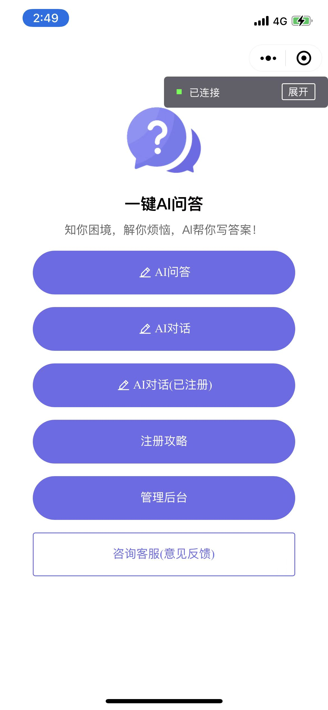
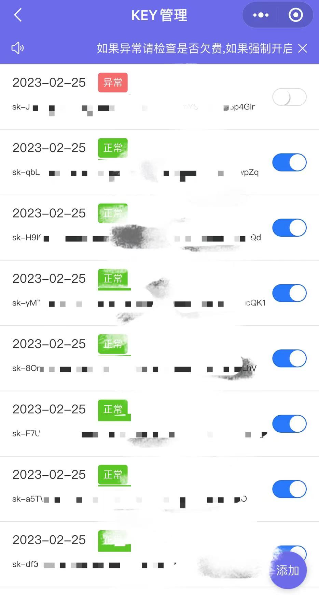
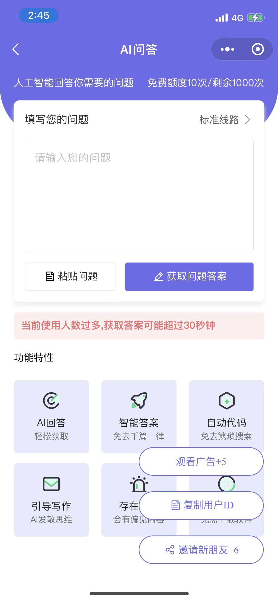
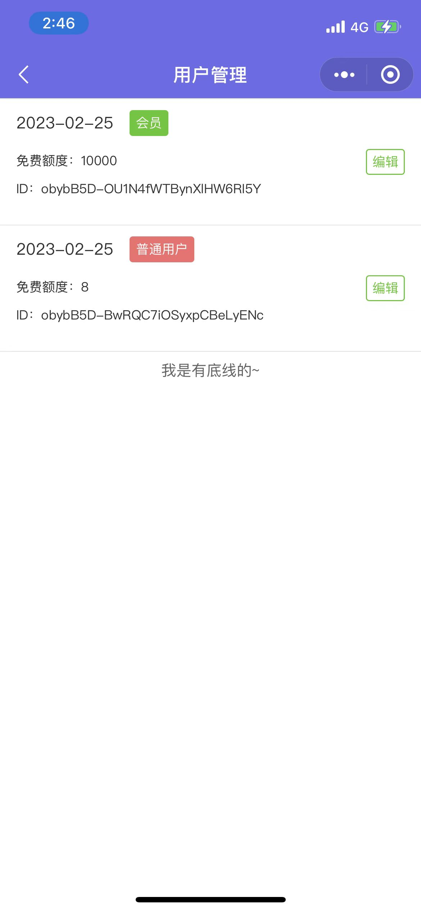
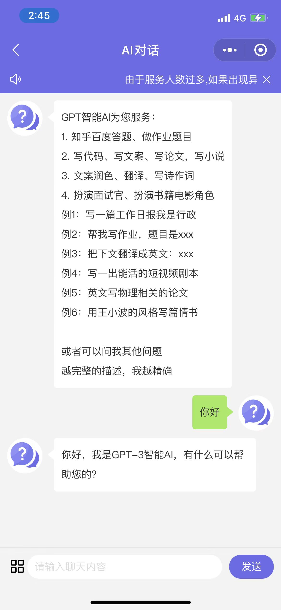
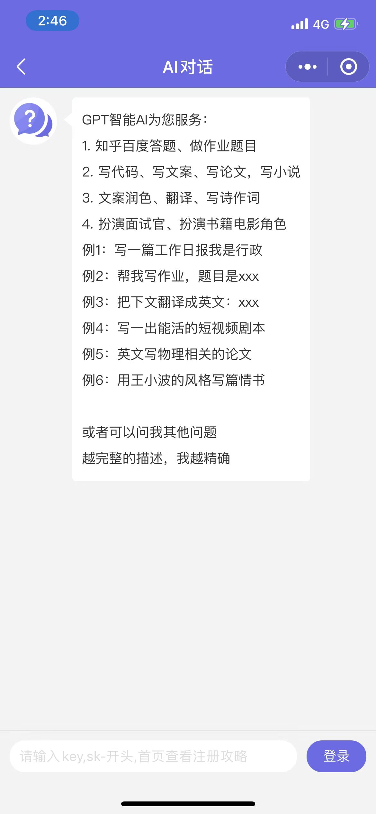
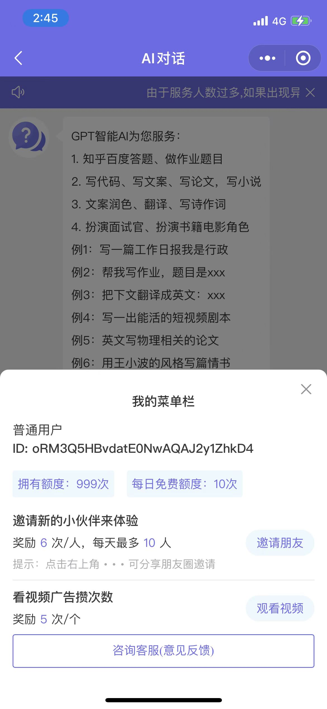
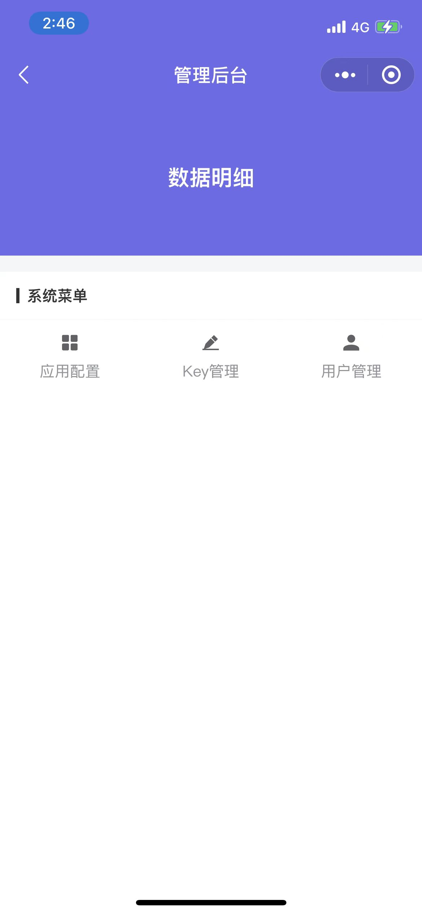

### 前言
ChatGPT云端一体项目，AI问答，AI对话上下文，会员标识，邀请好友。

购买须知：如果使用云端请先下载前端模板

1. 支持敏感词检测；
2. 支持多key轮询；
3. 支持同一云端搭建多个小程序（config表添加对应小程序）；
4. 支持流量主；
5. 云端源码：https://ext.dcloud.net.cn/plugin?id=11034

演示小程序：AI恋爱问答

### 在线体验
 

### 效果图

<table>
  <tr>
    <td></td>
    <td></td>
    <td></td>
    <td></td>
    <td></td>
    <td></td>
    <td></td>
    <td></td>
  </tr>
 </table>

### 流程

先导入前端模板

创建云服务选择阿里云在购买云端

选择您需要绑定的服务空间

部署完成后点击“继续导入到hbuilderx中选择已导入的前端模板”

右击unicloud文件，关联你刚才绑定的服务空间

关联好服务空间右键点击Cloudfunctions上传所有云函数和公共模板

初始化database/db_init.json 数据表（appid，secret统一改成自己的）！

运行到小程序上传即可。

config表：admin字段填写具备管理权限的用户

### 关于

云端部署问题：wx：vx172537

